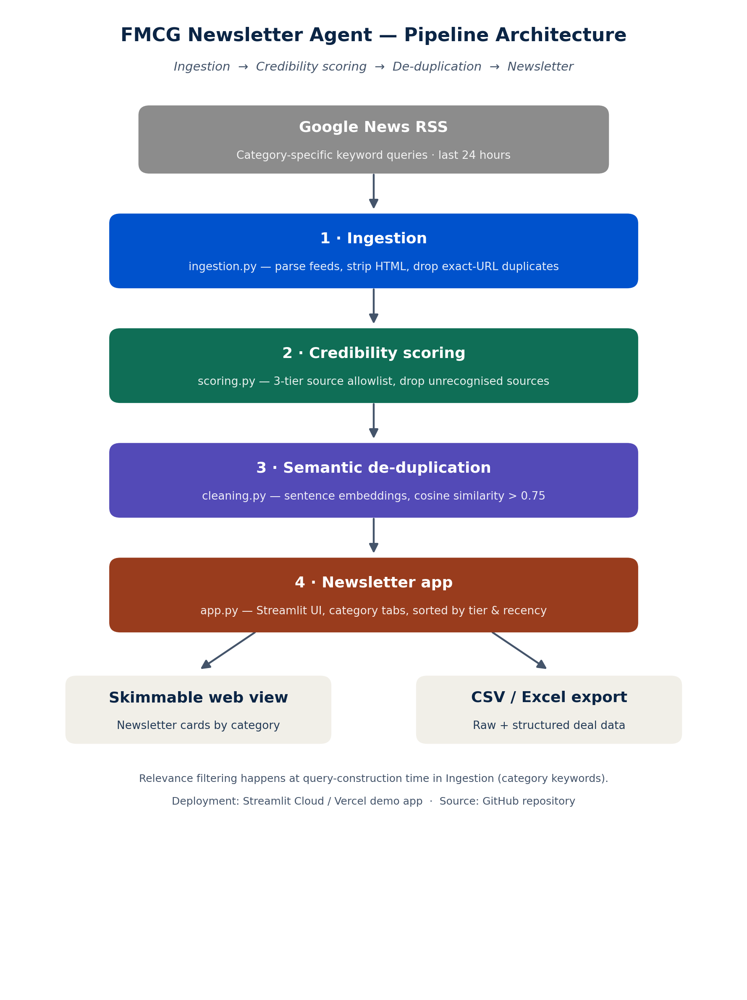

# FMCG M&A Intelligence Newsletter Agent

A lightweight "agent" that aggregates recent FMCG (Fast-Moving Consumer Goods) M&A and
investment news from public sources, removes duplicate/near-duplicate stories, filters for
source credibility, and renders a short, skimmable newsletter — live, in a Streamlit app.

> **Problem statement:** Create a solution that generates a concise FMCG industry intelligence
> newsletter on recent M&A and investment activity using publicly available news and articles,
> with real-time sourcing so the newsletter always reflects the latest developments.

---

## 1. What this does

| Requirement | How it's met |
|---|---|
| Aggregate deal-related FMCG news | `ingestion.py` pulls Google News RSS for a curated set of FMCG M&A/investment keywords, refreshed on demand |
| Remove duplicates / near-duplicates | `cleaning.py` — sentence-embedding cosine similarity across headline + summary |
| Filter for relevance to FMCG deals | Category-targeted keyword search queries at ingestion time (see [§4.4](#44-relevance-filtering)) |
| Check basic source credibility | `scoring.py` — 3-tier source allowlist |
| Output a structured newsletter draft | `app.py` — Streamlit UI with category tabs + CSV/Excel export |

---

## 2. Architecture



```
Google News RSS  →  Ingestion  →  Credibility scoring  →  De-duplication  →  Newsletter app
 (data source)      (ingestion.py)    (scoring.py)          (cleaning.py)      (app.py)
                                                                                  ├─ Web view (Streamlit)
                                                                                  └─ CSV / Excel export
```

The pipeline is intentionally a straight-line, four-stage "agent": **ingest → score → clean →
present**. Each stage is a pure function on a pandas DataFrame, which keeps the logic easy to
test, swap out, or run outside Streamlit (e.g. as a scheduled script).

---

## 3. Repository structure

```
assignment/
├── app.py                        # Streamlit app — orchestrates the pipeline + UI + export
├── ingestion.py                  # Stage 1: pull & normalise raw news from Google News RSS
├── scoring.py                    # Stage 2: source credibility tiering / filtering
├── cleaning.py                   # Stage 3: semantic de-duplication
├── config.py                     # FMCG category keywords, RSS template, credibility tiers
├── requirements.txt
├── .streamlit/config.toml        # Theme
├── docs/
│   └── architecture.png          # Architecture diagram (also embedded above)
```

---

## 4. Pipeline explanation

### 4.1 Ingestion (`ingestion.py`)

For every `(category, keyword)` pair in `config.CATEGORY_KEYWORDS`, the agent queries Google
News RSS with `keyword + after:<yesterday's date>`, so results are scoped to roughly the last
24 hours. Five categories are covered: **Food & Beverages, Personal Care & Toiletries,
Household & Cleaning Items, Health & Wellness,** and **General FMCG & Conglomerates**, each with
its own hand-picked keyword list (e.g. `"Britannia acquisition"`, `"FMCG merger India"`).

Each RSS entry is normalised into a row with `title`, `description` (HTML-stripped via
BeautifulSoup), `url`, `source`, `published_date`, and `category`. Exact-URL duplicates
(the same article returned by two overlapping keyword queries) are dropped immediately with
`drop_duplicates(subset="url")` — this is a cheap first pass, separate from the semantic
de-duplication that happens later.

### 4.2 Credibility scoring (`scoring.py`)

Every remaining article's `source` field is matched (case-insensitive substring match) against
three hand-curated allowlists in `config.py`:

| Tier | Score | Examples | Rationale |
|---|---|---|---|
| **Tier 1 — Wire & business press** | 2 | Reuters, Bloomberg, Economic Times, Moneycontrol, Business Standard, Livemint, CNBC-TV18 | Dedicated financial/deal desks, strong editorial standards |
| **Tier 2 — Mainstream press** | 3 | The Hindu, Times of India, Hindustan Times, Business Today, Forbes India | Reputable but not deal-specialist outlets |
| **Tier 3 — Official / regulatory** | 1 | BSE, NSE, SEBI, PIB, company press releases | Primary-source filings — highest trust, ranked first |
| **Unrecognised source** | 4 | Anything not in the above lists | Dropped by default (`filter_strict=True`) |

This is a **basic, transparent credibility check** — a source allowlist, not a fact-checking or
NLP-based trust model. It is a deliberate simplification appropriate for a first version: it's
auditable (anyone can see exactly which outlets are trusted and why), fast, and has no
false-negative risk from a model being "confidently wrong." The trade-off is that a legitimate
but unlisted outlet (e.g. a regional paper) is excluded unless someone adds it to `config.py`.
Setting `filter_strict=False` keeps unrecognised sources instead of dropping them, useful for
QA'ing what the keyword search is actually returning.

### 4.3 De-duplication (`cleaning.py`)

The same underlying deal is often reported by 3–5 outlets with different headlines (e.g. "ITC
to acquire Yoga Bar" vs. "ITC completes ₹700cr Yoga Bar buyout"). Exact-URL matching (§4.1)
cannot catch this. Instead:

1. Each article's `title + description` is embedded with a sentence-transformer
   (`all-MiniLM-L6-v2`, 384-dim, running locally — no external API call).
2. Pairwise cosine similarity is computed across **all** embeddings.
3. Articles are scanned in order; the **first occurrence** of a similarity cluster is kept as
   the canonical article, and every later article scoring **> 0.75** cosine similarity against
   it is flagged `is_duplicate=True` with `duplicate_of_title` pointing back to the canonical
   headline.

This is an **O(n²) greedy clustering**, not a full agglomerative clustering — intentional, since
the volume per run (tens, not thousands, of articles/day) makes the pairwise cost negligible,
and greedy-first-seen is simple to reason about and debug (`duplicate_of_title` always traces
back one hop). The 0.75 threshold was picked empirically — it's loose enough to catch
same-story paraphrases across outlets but tight enough to keep genuinely distinct deals in the
same category separate. It's the one number in the pipeline most worth tuning against real
traffic: too low merges distinct-but-similar deals (e.g. two different Marico acquisitions in
the same week), too high lets near-duplicates slip through.

algorithm**
> (pairwise cosine similarity above a threshold, first-seen-wins) on realistic sample data. The
> deployed `app.py` uses the real `sentence-transformers` embeddings exactly as written — this
> substitution only affects how the illustrative sample files were produced, not the app itself.

### 4.4 Relevance filtering

There is **no separate relevance classifier** in this pipeline — relevance is enforced
**upstream, at query-construction time**, by only ever searching Google News with FMCG- and
deal-specific keywords (`"<company/segment> acquisition"`, `"<segment> funding India"`, etc.),
scoped per category. This is a deliberate scope simplification for a v1:

- **Pro:** zero false-negatives from a classifier mis-scoring a real deal as irrelevant; fully
  transparent (the keyword list *is* the relevance policy, visible in `config.py`); no extra
  model/API dependency.
- **Con:** precision depends entirely on keyword quality — a broad query like `"FMCG investment
  India"` can occasionally surface a tangential or non-deal story (e.g. a general market
  commentary piece), which today only gets caught by a human skimming the digest.

**Suggested v2 enhancement:** add a lightweight zero-shot or keyword-scored relevance filter
(e.g. "does this headline mention an acquisition/investment/funding/stake/merger verb + an
FMCG company or category noun") as an explicit stage between ingestion and scoring, so relevance
becomes an auditable score in the data (like `credibility_score`) rather than an implicit
property of the search query.

### 4.5 Newsletter rendering & export (`app.py`)

The cleaned, credibility-filtered, non-duplicate rows are sorted by `credibility_score` (best
first) then recency, and rendered as category-tabbed cards in Streamlit. The sidebar offers
one-click **CSV** and **Excel** export of the same clean dataset. This repo additionally ships
sample **Word** and **PowerPoint** versions of the same structured content (see §6) since the
brief asks for the newsletter in Excel/Word/PPT format — `app.py` itself only exports
CSV/Excel live; the docx/pptx exports are generated by the standalone scripts described below.

---

## 5. Running the app locally

```bash
cd assignment
pip install -r requirements.txt
streamlit run app.py
```

The first run downloads the `all-MiniLM-L6-v2` sentence-transformer model (~90 MB, one-time,
requires internet). Use the **"Refresh / Fetch Fresh News"** button in the sidebar to re-run the
pipeline against the latest Google News results at any time.

### Deploying the demo app

The app is stateless and has no secrets, so it deploys as-is to either:

- **Streamlit Community Cloud** — push this folder to a GitHub repo, connect it at
  [share.streamlit.io](https://share.streamlit.io), point it at `app.py`, done.
- **Vercel** — Vercel doesn't run long-lived Python servers natively, so Streamlit apps are
  typically deployed there via a Docker-based deployment or a Vercel Python runtime wrapper;
  Streamlit Community Cloud is the more direct fit for this app.

> **This deliverable does not include a live demo-app URL or a GitHub repo URL.** The
> documentation, sample data, and newsletter exports here were prepared in an offline sandbox
> with no internet/deployment access, so I was not able to actually push this code to GitHub or
> deploy it to Streamlit Cloud on your behalf. The repo above is fully deploy-ready — push it to
> a new GitHub repo and connect that repo to Streamlit Community Cloud to get both links in a
> few minutes; see the steps just above.


## 7. Assumptions & known limitations

- **Coverage window** is the last 24 hours from time of run — a design choice for a "daily
  digest" cadence; easy to widen via the `after:` clause in `ingestion.py`.
- **Relevance is keyword-driven, not ML-scored** (see §4.4) — precision depends on keyword
  quality in `config.py`.
- **Credibility is a static source allowlist**, not per-article fact-checking — see §4.2.
- **De-duplication threshold (0.75)** was set empirically on a small sample; it should be
  revisited against a larger corpus of real daily pulls.
- **Geography/company keywords are India-focused** — global FMCG coverage would need additional
  keyword sets and possibly a non-Indian-edition Google News RSS locale.

